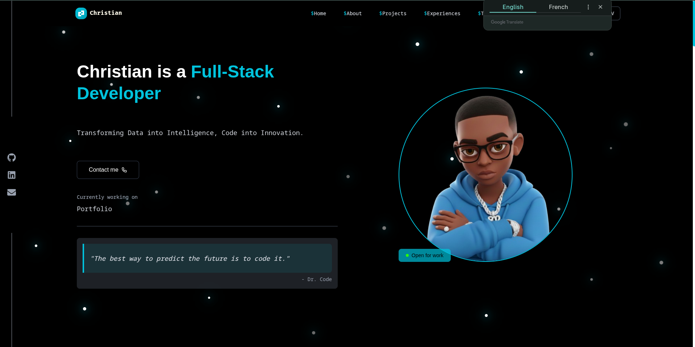
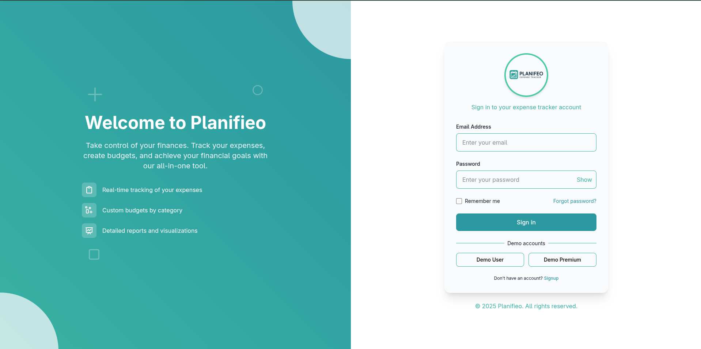
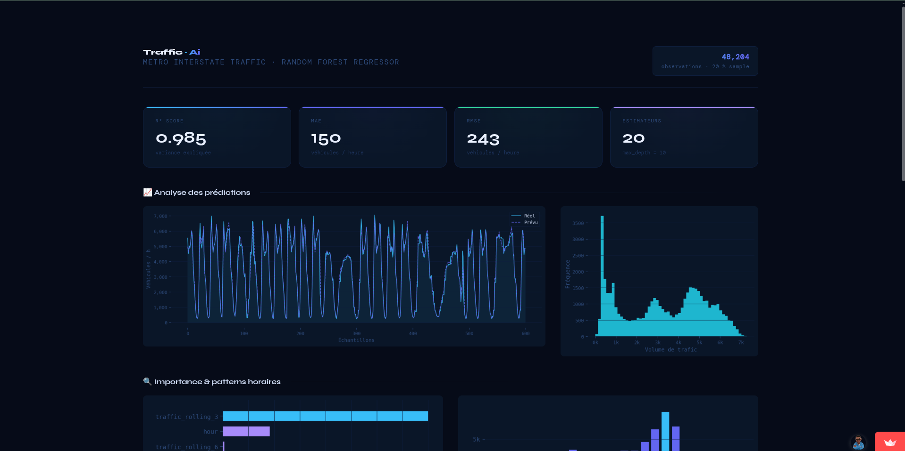
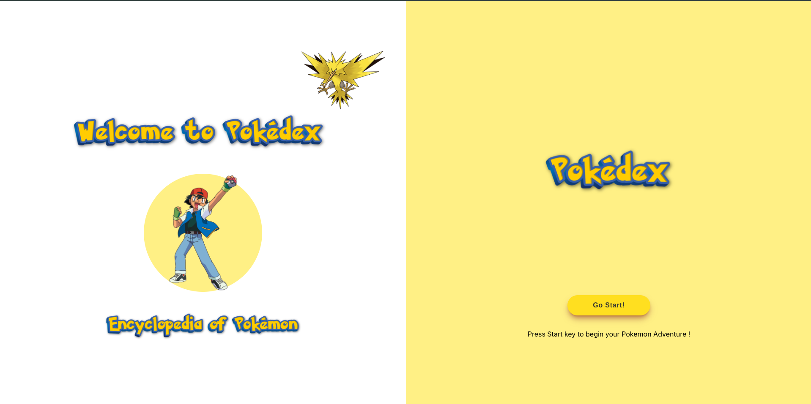

<div align="center">


<br/>

<br>
<p align="center">
    <h1 align="center">✩&emsp;ChristianMDG&emsp;✩</h1>
</p>
<p align="center">
    
</p>
<br>

[](https://linkedin.com/in/ChristianRavelojaona)
[](https://christian-portfolio-u9jz.vercel.app/)
[](mailto:hei.christian.3@gmail.com)
[](https://github.com/ChristianMDG)

</div>

<br/>

---

<table>
<tr>
<td width="55%" valign="top">

## `$ whoami`

```typescript
const christian = {
  name     : "Christian RAVELOJAONA",
  location : "Antananarivo, Madagascar 🇲🇬",
  roles    : [
    "FullStack Developer 🚀",
    "Data Scientist 📊",
    "AI Explorer 🤖",
  ],

  stack: {
    frontend : ["React", "Vite", "TailwindCSS", "Three.js"],
    backend  : ["Node.js", "Express.js", "Spring Boot", "FastAPI"],
    database : ["PostgreSQL", "Prisma"],
    data_ai  : ["Python", "TensorFlow", "Scikit-learn",
                "Pandas", "NumPy", "Matplotlib"],
    langs    : ["TypeScript", "JavaScript", "Java", "Python"],
  },

  learning : ["Spring Boot 🌱", "Deep Learning 🧠"],
  openTo   : "Freelance · Open Source · AI Projects",
  funFact  : "I turn data into insights & coffee into code ✨",
};
```

</td>
<td width="45%" valign="top">

## `$ status`

```bash
christian@mdg ~ $ status

  roles     → FullStack Dev · Data Sci · AI
  location  → Madagascar 🇲🇬
  learning  → Spring Boot · Deep Learning
  goal      → Build impactful AI products
  contact   → hei.christian.3@gmail
  portfolio → https://christian-portfolio-u9jz.vercel.app/ ↗

  # availability
  status    → ● Open to work
  open_to   → Freelance · Collab · AI

christian@mdg ~ $ _
```

> *"Turning data into decisions*
> *and ideas into code."*

</td>
</tr>
</table>

<br/>

---

## ⚡ Tech Arsenal

<div align="center">

### 🎨 Frontend

<p align="center">
<a href="https://reactjs.org/"></a>&nbsp;
<a href="https://www.typescriptlang.org/"></a>&nbsp;
<a href="https://developer.mozilla.org/en-US/docs/Web/JavaScript"></a>&nbsp;
<a href="https://vitejs.dev/"></a>&nbsp;
<a href="https://tailwindcss.com/"></a>&nbsp;
<a href="https://threejs.org/"></a>&nbsp;
<a href="https://developer.mozilla.org/en-US/docs/Web/HTML"></a>&nbsp;
<a href="https://developer.mozilla.org/en-US/docs/Web/CSS"></a>
</p>

### ⚙️ Backend

<p align="center">
<a href="https://nodejs.org/"></a>&nbsp;
<a href="https://expressjs.com/"></a>&nbsp;
<a href="https://spring.io/projects/spring-boot"></a>&nbsp;
<a href="https://fastapi.tiangolo.com/"></a>&nbsp;
<a href="https://www.java.com/"></a>
</p>

### 🗄️ Database & ORM

<p align="center">
<a href="https://www.postgresql.org/"></a>&nbsp;
<a href="https://www.prisma.io/"></a>
</p>

### 🤖 Data Science & AI / ML

<p align="center">
<a href="https://www.python.org/"></a>&nbsp;
<a href="https://www.tensorflow.org/"></a>&nbsp;
<a href="https://pytorch.org/"></a>&nbsp;
<a href="https://scikit-learn.org/"></a>&nbsp;
<a href="https://numpy.org/"></a>&nbsp;
&nbsp;
&nbsp;
<a href="https://jupyter.org/"></a>&nbsp;

</p>

### 🛠️ Tools & Design

<p align="center">
<a href="https://git-scm.com/"></a>&nbsp;
<a href="https://github.com/"></a>&nbsp;
<a href="https://www.figma.com/"></a>&nbsp;
<a href="https://www.canva.com/"></a>&nbsp;
<a href="https://www.linux.org/"></a>&nbsp;
<a href="https://code.visualstudio.com/"></a>
</p>

</div>

<br/>

<!-- ---

## 📊 GitHub Analytics

<div align="center">


&nbsp;


<br/><br/>


</div>

<br/>

--- -->

## 📈 Contribution Graph

<div align="center">

[](https://github.com/ChristianMDG)

</div>

<br/>

<!-- ---

## 🏆 GitHub Trophies

<div align="center">


</div>

<br/>

---
-->

<h2 align="center">🚀 Projects</h2>

<div align="center">

<table width="100%" cellspacing="15" cellpadding="10">

  <tr>
    <td align="center" width="50%" style="padding:15px;">
      <a href="https://christian-portfolio-u9jz.vercel.app/">
        
      </a>
      <br/><br/>
      <div align="center" style="display: flex; align-items: center; justify-content: center; gap: 5px;">
  <br/>
  <b>Portfolio</b>
</div>
      <br/>
      <sub>React • Tailwindcss • Framer Motion</sub><br/><br/>
      <a href="https://christian-portfolio-u9jz.vercel.app/">🔗 Live Demo</a> •
      <a href="https://github.com/ChristianMDG/Christian_Portfolio">💻 Source Code</a>
      <br/>
    </td>
    <td align="center" width="50%" style="padding:15px;">
      <a href="https://planifeo.vercel.app/">
        
      </a>
      <br/>
      <b>Planifeo App</b><br/>
      <sub>React • Node.js • Express Js • Prisma </sub>
      <br/>
      <br/>
      <a href="https://planifeo.vercel.app/">🔗 Live Demo</a> •
      <a href="https://github.com/ChristianMDG/Planifeo_frontend">💻 Source Code Frontend</a>
      <br/>
       <a href="https://github.com/ChristianMDG/Planifeo_backend">💻 Source Code Backend</a>
    </td>
  </tr>

  <tr>
    <td align="center" width="50%" style="padding:15px;">
      <a href="https://traffic-ai-3szvrge57wehtps7ghcb2d.streamlit.app/">
        
      </a>
      <br/><br/>
      <b>📊 Trafic-Ai</b><br/>
      <sub>Python • Streamlit • Pandas</sub><br/><br/>
      <a href="https://traffic-ai-3szvrge57wehtps7ghcb2d.streamlit.app/">🔗 Live Demo</a> •
      <a href="https://github.com/ChristianMDG/Traffic-Ai">💻 Source Code</a>
    </td>
    <td align="center" width="50%" style="padding:15px;">
      <a href="https://pokedex-tta8.vercel.app/">
        
      </a>
      <br/><br/>
      <b>🧠 Pokedex</b><br/>
      <sub>React • Vite • Tailwindcss</sub><br/><br/>
      <a href="https://pokedex-tta8.vercel.app/">🔗 Live Demo</a> •
      <a href="https://github.com/ChristianMDG/Pokedex">💻 Source Code</a>
    </td>
  </tr>

</table>

</div>
<br/>

<!-- --- 

## 🌱 Learning Progress

## 🚀 Tech Stack Progress

🔹 **Spring Boot**  
████████░░  
🔥 Active  

🔹 **TensorFlow / Deep Learning**  
██████░░░░  
🧠 Ongoing  

🔹 **PyTorch**  
█████░░░░░  
🌱 Learning  

🔹 **React Advanced**  
██████████  
✅ Completed  

🔹 **PostgreSQL Deep Dive**  
███████░░░  
📚 Ongoing  

🔹 **Python Data Science**  
████████░░  
📊 Active  

<br/>

--- -->
<!-- 
## 🐍 Contribution Snake

<div align="center">

<picture>
  <source media="(prefers-color-scheme: dark)" srcset="https://raw.githubusercontent.com/ChristianMDG/ChristianMDG/output/github-snake-dark.svg"/>
  <source media="(prefers-color-scheme: light)" srcset="https://raw.githubusercontent.com/ChristianMDG/ChristianMDG/output/github-snake.svg"/>
  
</picture>

> 💡 Activate with GitHub Actions — see [platane/snk](https://github.com/platane/snk)

</div>

<br/>

--- -->

## 🤝 Let's Connect

<div align="center">

<a href="https://linkedin.com/in/ChristianRavelojaona">
  
</a>
&nbsp;
<a href="https://christian-portfolio-u9jz.vercel.app/">
  
</a>
&nbsp;
<a href="mailto:hei.christian.3@gmail.com">
  
</a>

</div>

<br/>

 ---

<div align="center">

```
╔═══════════════════════════════════════════════════╗
║  "The best way to predict the future is to        ║
║   code it."               — Christian MDG  🚀     ║
╚═══════════════════════════════════════════════════╝
```

**Madagascar 🇲🇬 · © 2025 Christian RAVELOJAONA**

</div>
